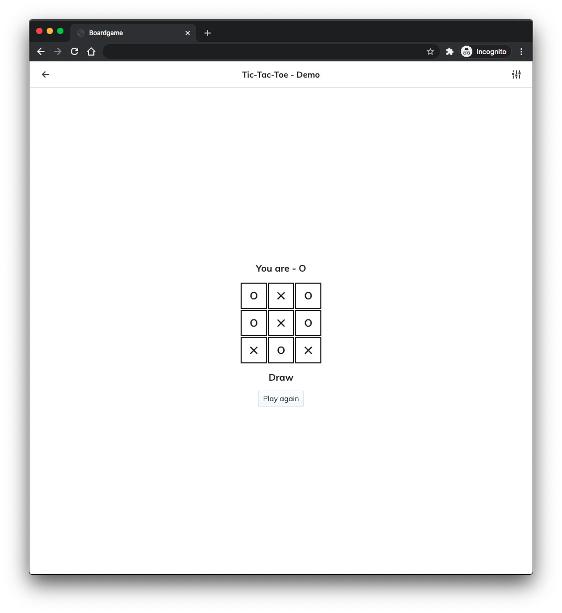
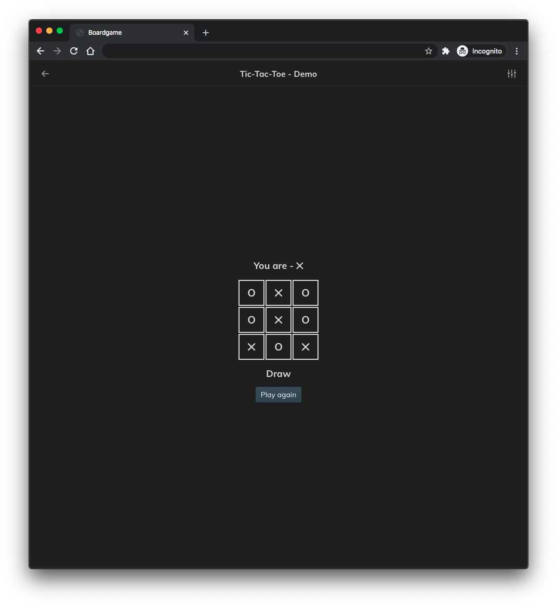

## Boardgame

A project building boardgame with React and [boardgame.io](https://boardgame.io/)

<div>
  
  
</div>

<br />

### Development

`Mongodb` is required for development. Create a file named `.env.local` into `packages/web` and set your `mongodb` url

```
MONGODB_URI = mongodb://localhost:27017/boardgame
```

Run below cmd if you are fist-time to clone this repo.

```
yarn db build
```

If do not update server just run

```
yarn web dev
```

else run

```
yarn dev
```

### Testing

> After development, you will run `yarn build` or `yarn web build` before testing

Start testing

```
yarn e2e test
```

Test specific file

```
yarn e2e test packages/e2e/test/xxxx.e2e-spec.ts
```

disable headless mode

```
HEADLESS=false yarn e2e test
```

### Contribution

1. Clone a template into `packages/web/src/games`

```
node scripts/clone.js NewGameName
```

2. Open `packages/web/games/index.ts` and `packages/web/server/startServer.ts`. Import the new game correctly

3. Start development :P

### TODO

- [ ] Display player name
- [ ] Mongodb TTL
- [ ] i18n
- [ ] Lobby improvement
